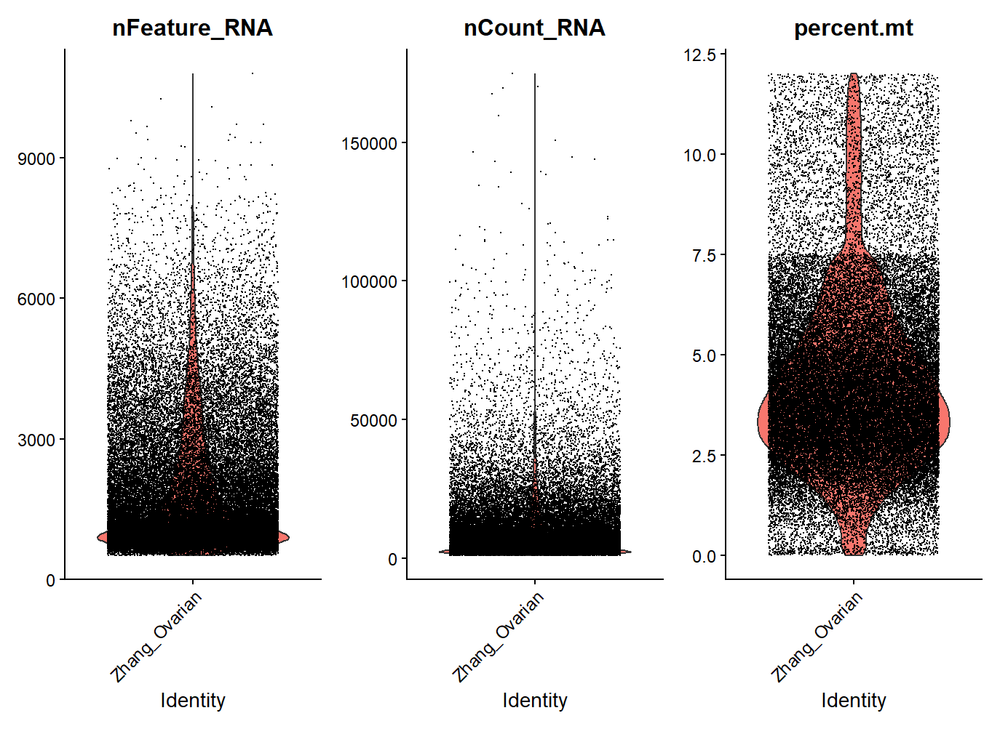
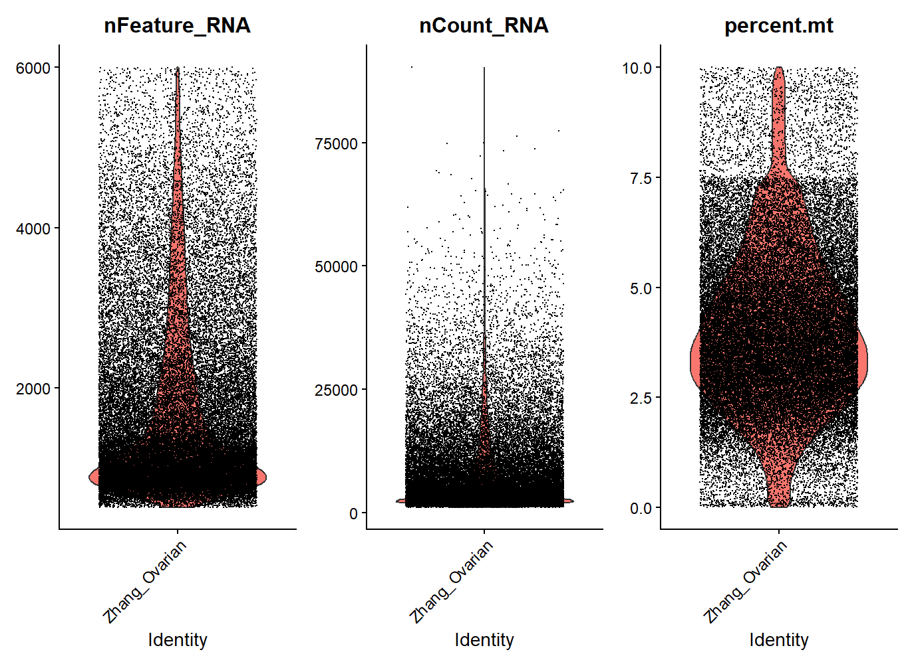
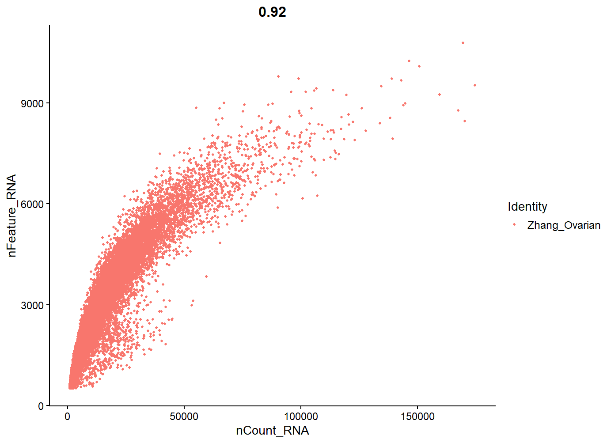
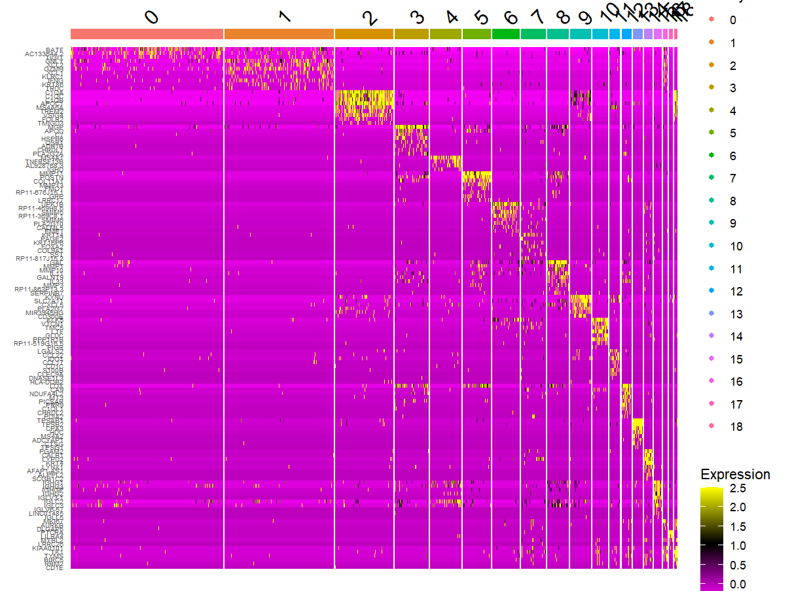

# Figure Captions — Single-Cell RNA-Seq (Ovarian)

Dataset Source: Zhang Q. et al., 2022 — Ovarian cancer single-cell RNA-seq (CNGBdb, Science Advances, DOI: 10.1126/sciadv.abm1831)

> Short, scannable captions for each figure in the analysis.  

---

## QC & Filtering

### step1_before_filter.png

- Shows: QC metrics before filtering (nFeature_RNA, nCount_RNA, percent.mt)
- Takeaway: Outliers and high mitochondrial percentage cells detected.

### step1-after_filter.png

- Shows: QC metrics after filtering.
- Takeaway: Improved distribution; clean dataset for downstream analysis.

### feature_scatter_before_filtering.png

- Shows: Feature scatter plot before filtering.
- Takeaway: Visualizes cell quality variation before cleanup.

---

## PCA & Dimensionality

### step 2 PCA Scatter Plot.png

- Shows: PCA projection of top HVGs.
- Takeaway: Reveals variance-driven structure among cells.

### step2_PCA_Loadings_Plot.png

- Shows: PCA loadings for each component.
- Takeaway: Identifies key genes contributing to each PC.

### step 2 elbow plot.png

- Shows: Variance explained by PCs.
- Takeaway: Top ~15 PCs retained for clustering.

---

## Clustering & Annotation

### step 3 Umap.png

- Shows: UMAP projection of cell clusters.
- Takeaway: Visual separation of distinct subpopulations.

### annotated umap.png

- Shows: UMAP labeled with identified cell types.
- Takeaway: Biological identities assigned to clusters.

---

## Pseudotime

### combine with cluster labels pseudotime.png

- Shows: Monocle pseudotime trajectory overlaid on clusters.
- Takeaway: Cells ordered from immune to proliferative states.

### pseudotime plots.png

- Shows: Gene expression changes along pseudotime.
- Takeaway: Early immune TFs fade as proliferative TFs increase.

### 12 tf factors pseodotime analysis.png

- Shows: 12 transcription factors along pseudotime.
- Takeaway: BATF/XCL1 dominate early; E2F8/FOXA2/MYBL2 dominate later.

---

## Markers, Enrichment & Networks

### top 5 marker per clustor.png

- Shows: Top marker genes per cluster.
- Takeaway: Cluster-specific expression patterns validated.

### heatmap.png

- Shows: Expression heatmap of marker genes.
- Takeaway: Distinct patterns confirm cluster identity.

### ppi network.png

- Shows: STRING PPI network of hub genes.
- Takeaway: FOXA2–E2F8–MYBL2 act as key regulators of proliferation.

### venn diagram.png

- Shows: Overlap between gene sets.
- Takeaway: Highlights shared vs unique genes across clusters.
